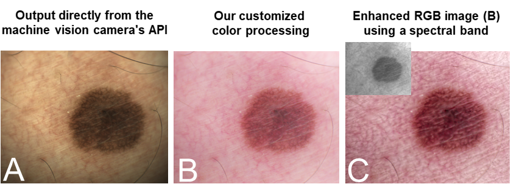

(A) Image directly obtained using the machine vision camera's API. (B)  Result from our customized camera processing pipeline after color calibration and photo-finishing.  (C)  Enhancement of the visible imaging using a selected spectral band to highlight melanin pigmentation. The narrow band image is shown as an inset.
### Abstract ###
This paper describes the customization of the camera processing pipeline of a machine vision camera that has been integrated into a hand-held dermatological imaging device.   The device uses a combination of visible and non-visible spectral LEDs to allow capture of visible RGB imagery as well as selected non-visible wavelengths.   Our customization involves two components. The first component is a color calibration procedure that ensures the captured images are colorimetrically more accurate than those obtained through the machine vision camera's native API.  The need for color calibration is a critical component that is often overlooked or poorly understood by computer vision engineers.  Our second component is a fast method to integrate the narrow band spectral images (some of which are outside the visible range) into the visible RGB image for enhanced visualization.  This component of our pipeline involves evaluating several algorithms capable of multiple image fusion to determine the most suitable one for our application.  Quantitative and subject results, including feedback from clinicians, demonstrate the effectiveness of our customization procedure.

#### Publications: ####
* Karaimer H.C., Khodadad I., Kazemzadeh F., Brown M.S. (2019) "A Customized Camera Imaging Pipeline for Dermatological Imaging", *ISIC Skin Image Analysis Workshop* (at **CVPR`19**), June 2019 [[pdf]](./paper/Karaimer_et_al_2019.pdf) [[bibtex]](./bib/Karaimer_et_al_2019.bib) 

## Code and Data##

We are not able to share the code for this projet due to a non-disclosure agreement(NDA), but happy to share the data. Please send Hakki Karaimer an email if you are interested in the data. 

## People ##
[Hakki Can Karaimer](https://karaimer.github.io/), 	karaimer (at) eecs.yorku.ca

[Iman Khodadad](http://www.elucidlabs.com/), 	iman (at) elucidlabs.ca

[Farnoud Kazemzadeh](http://www.elucidlabs.com/), 	farnoud (at) elucidlabs.ca

[Michael S. Brown](http://www.cse.yorku.ca/~mbrown/), 	mbrown (at) eecs.yorku.ca
